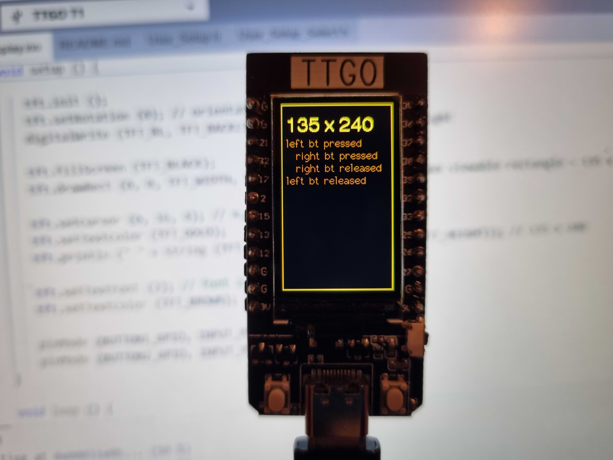

# Getting started with TTGO T-Display ESP32 with 1.14 inch LCD with Arduino TFT_eSPI 

If this helps saving the other happy owners some time.   

## Version of Arduino

1. Use Arduino 2.2.1

## Board 

2. Select TTGP T1 board

## Libraries

3. Install TFT_eSPI library

## User_Setup.h and User_Setup_Select.h  

4. Replace User_Setup.h and User_Setup_Select.h files in ...\Documents\Arduino\libraries\TFT_eSPI folders with the ones found here.

## Compile and upload the sketch

## Documentation

[https://f6czv.fr/en/documentation-on-esp32-and-the-ttgo-t-display](https://f6czv.fr/en/documentation-on-esp32-and-the-ttgo-t-display)

[https://www.lilygo.cc/products/lilygo%C2%AE-ttgo-t-display-1-14-inch-lcd-esp32-control-board](https://www.lilygo.cc/products/lilygo%C2%AE-ttgo-t-display-1-14-inch-lcd-esp32-control-board)

[https://github.com/Bodmer/TFT_eSPI](https://github.com/Bodmer/TFT_eSPI)
